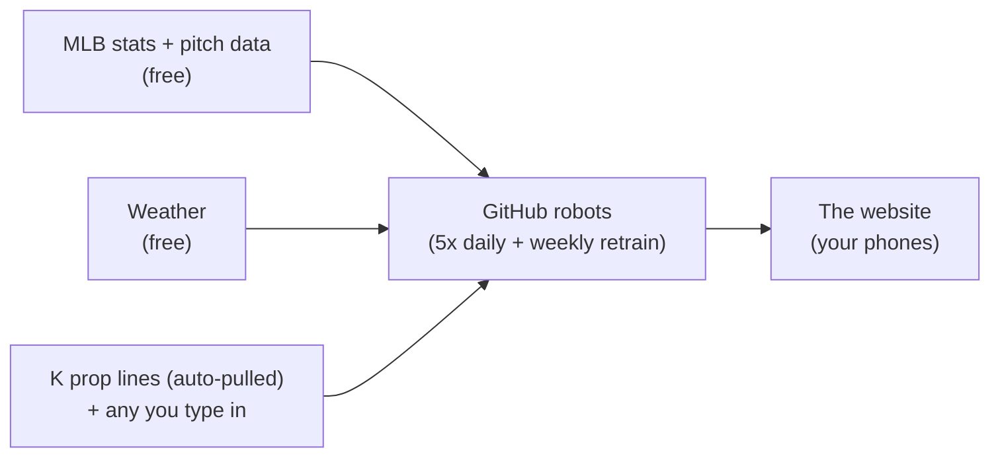

# K Board — MLB Strikeout Projections (free, runs itself)

## What is this?

Every day during baseball season, this project predicts how many strikeouts each
MLB starting pitcher will throw. It puts those predictions on a private little
website you and your friends can open on your phones. If you type in the
strikeout over/under lines from your sportsbook app, it also tells you which
bets look mathematically good — and it keeps a public scoreboard of its own
hits and misses, so you always know if the model is actually any good.

You don't need to install anything on your computer, and it costs $0. Everything
runs on GitHub — a free website where people store code and which will also run
small scheduled jobs and host simple websites for free.

**What you'll have when setup is done:**

- A website like `https://yourname.github.io/mlb-k-projection/` — bookmark it on your phone.
- It refreshes itself five times a day automatically. You never have to touch
  it — but a ⟳ Refresh button at the top of the site triggers an instant update.
- K prop lines pull automatically from the books once a day. You can still
  type lines in from your phone (manual_lines.csv) to add books, update stale
  lines, or record closing lines — the site rescores a couple of minutes later.

## How it works, in plain words

GitHub's computers wake up five times a day. Every night at 9:10 PM Arizona time —
after most games have finished — they score the completed slate against what the
model predicted, then project the FOLLOWING day. Every morning around 10:10 AM
AZ they pull the day's betting lines from the books and settle any late
West-coast games from the night before. Quick refreshes at 9:10 AM, 1:10 PM,
and 3:10 PM AZ keep lineups and projections current through the afternoon (the
3:10 PM run also re-pulls lines on the biggest-edge games). Once a week they re-train the model on
everything seen so far. Every prediction is saved before games start and every
result is checked — wins, losses, and all. None of it runs on your computer.

---

# Setup — step by step (about 30 minutes, one time)

You need: a computer, this folder (`mlb-k-projection`), and an email address.

## Part 1 — Create a GitHub account

1. Go to **github.com** → **Sign up**. Free account is all you need.
2. Pick a username — it becomes part of your website address
   (`yourname.github.io/mlb-k-projection`), so pick something you don't mind
   friends seeing.

## Part 2 — Put this folder on GitHub

Easiest way is the **GitHub Desktop** app (no typing commands). The key is to
use **"Add local repository"** — *not* "New repository" — so it uses your
existing folder instead of creating an empty one:

1. Download **GitHub Desktop** from **desktop.github.com**, install it, and sign
   in with your new account.
2. In GitHub Desktop: **File → Add local repository…**
3. Click **Choose…** and select the **`mlb-k-projection` folder itself** (open
   it so the dialog shows its contents, then Select Folder).
4. Desktop will say *"This directory does not appear to be a Git repository.
   Would you like to **create a repository here** instead?"* — click that blue
   **create a repository here** link.
5. A "Create a repository" form appears with Name `mlb-k-projection` already
   filled in. **Don't change anything** → click **Create Repository**.
6. Commit the files — what you see depends on your Desktop version:
   - *Either* the left panel lists ~45 changed files → type `first upload` in
     the bottom-left box → **Commit to main**;
   - *or* it already says "No local changes" with **"Initial commit"** shown at
     the bottom — Desktop committed everything automatically. Verify via the
     **History** tab: "Initial commit" should list README.md, docs/…, kproj/…
     If History shows only 1–3 files, the repo is rooted in the wrong folder —
     see "Fixing a bad first publish" below.
7. Click **Publish repository** (blue button, top bar):
   - **Uncheck "Keep this code private"** — the free website and unlimited
     automation require a public repo. There's nothing sensitive in it.
   - Click **Publish**.
8. **Check it worked before moving on:** go to
   `github.com/yourname/mlb-k-projection` in a browser. You should see
   `docs`, `kproj`, `lines`, `README.md` etc. **directly in the file list**
   (not buried inside another folder, not empty). If the repo looks empty or
   wrong, see "Fixing a bad first publish" below.

> If GitHub Desktop throws errors about OneDrive, copy `mlb-k-projection` to
> somewhere like `C:\Projects\` first and add *that* copy. After publishing,
> GitHub holds the master copy anyway.

<b>Fixing a bad first publish</b> (empty repo, or files nested in a subfolder)

1. Delete the bad repo on github.com: open the repo → **Settings** → scroll to
   the bottom **Danger Zone** → **Delete this repository** → type the
   confirmation text it asks for.
2. In GitHub Desktop: **Repository → Remove repository** (this only removes it
   from the app, it deletes nothing on disk).
3. If Desktop created a stray folder, delete it in File Explorer. Common spots:
   `Documents\GitHub\…`, or a *nested* `mlb-k-projection` folder **inside** your
   real `mlb-k-projection` folder (close GitHub Desktop first if Windows says
   it's in use). Don't touch the real project folder itself.
4. Start Part 2 again from step 2 — using **Add local repository**.
5. If **Publish** complains the repo name already exists on GitHub, you skipped
   step 1 — delete the old repo on github.com, then Publish again.

## Part 3 — Turn on the website

First make sure Part 2 step 8 passed (the `docs` folder is visible at the top
level of your repo) — the **/docs** option below only appears if it is.

1. On your repo page (`github.com/yourname/mlb-k-projection`) → **Settings**
   (tab, far right) → **Pages** (left sidebar).
2. Under **Build and deployment**: Source = **Deploy from a branch**.
3. Branch = **main**, and in the folder dropdown next to it pick **/docs** →
   **Save**.
4. Wait ~2 minutes, then refresh that settings page — a banner appears:
   *"Your site is live at https://yourname.github.io/mlb-k-projection/"*.
   Open it. It will say "No data yet" — normal, we haven't loaded anything.

Troubleshooting: no **/docs** in the dropdown → the repo doesn't have `docs` at
its top level (redo Part 2, see "Fixing a bad first publish"). Pages asking you
to upgrade → the repo got published private (repo **Settings → General →
Danger Zone → Change visibility → Public**, then retry).

## Part 4 — (Optional but recommended) free Vegas odds feed

One free key powers two things: game run totals (a clue for how long starters
stay in) and daily pitcher K prop lines (what the edge-finder bets against).
Free, 2 minutes:

1. Go to **the-odds-api.com** → get a free API key (500 requests/month tier).
   The key arrives by email.
2. Repo → **Settings → Secrets and variables → Actions → New repository secret**.
3. Name: `ODDS_API_KEY` (exactly that). Value: paste the key → **Add secret**.

Skip this and everything still works — the model uses recent team scoring instead.

## Part 5 — Load four years of history

Now you tell the GitHub robots to download 2022–today. "Actions" is the tab
where the robots live; a "workflow" is one robot task.

1. Repo → **Actions** tab. If a banner asks you to enable workflows, enable them.
2. Click **Backfill history** (left sidebar) → **Run workflow** (right side) —
   a small form appears.
3. Run it **five times**, once per season, with these dates (wait for each to
   finish before starting the next — a green checkmark appears when done,
   roughly 30–60 minutes each):

   | Run | start_date | end_date | fetch_weather |
   |---|---|---|---|
   | 1 | 2022-03-01 | 2022-11-15 | leave unchecked |
   | 2 | 2023-03-01 | 2023-11-15 | leave unchecked |
   | 3 | 2024-03-01 | 2024-11-15 | leave unchecked |
   | 4 | 2025-03-01 | 2025-11-15 | leave unchecked |
   | 5 | 2026-03-01 | *(leave blank)* | **check the box** |

   Tip: start run 1 before dinner, the rest can go overnight — they're
   fire-and-forget. If one fails (red X), just run it again with the same
   dates; it picks up where it left off.

## Part 6 — Train the first model

1. **Actions → Weekly retrain → Run workflow** (leave "quick" unchecked) → run.
2. Takes ~10–20 minutes. After this, the model exists.

## Part 7 — First refresh & phone bookmark

1. **Actions → Daily refresh → Run workflow.** ~5 minutes.
2. Open your site — today's pitchers should appear with projections.
3. On your phone, open the site in the browser → **Add to Home Screen**. Send
   the link to your friends. Done — from here on it runs itself.

---

# Everyday use

## Reading the site

| What you see | What it means |
|---|---|
| **Proj K** (big number) | Most likely strikeout total for that start |
| **The bar** (p10–p90) | Realistic range. 8 times out of 10 the real number should land in the shaded band |
| **Lineup confidence** | Green = official lineup posted. Yellow/red = model is guessing the lineup (it guesses well, but ranges widen) |
| **Picks under a card** | Ranked by **probability edge** — how many points more often the model expects the bet to win vs the market's vig-free number. "win 61% (+4.2 pts)" = model says 61%, market implies ~57%. Only positive-EV sides show. No pick = no good bet, which is most of the time. That's honest, not broken |
| **¼K (quarter-Kelly)** | Suggested bet size as % of your bankroll, deliberately conservative |
| **Performance page** | The model's full track record — ROI, hit rate, and whether its confidence matches reality (calibration). If the model is cold, this page will say so |

**Signals tab:** answers "should I actually bet this, and now?" Each starter
gets a pick window — GO (edge ≥5 pts, lineups posted, fresh un-moved line),
CAUTION (something to verify first), WAIT (no edge/no line), OFF (started or
scratched) — with the reasons spelled out. Cards compare our number vs the
book line (with movement since open) vs FanGraphs, and show any tracked
capper's pick with an agree/disagree call. Below that: a scorecard of each
capper's parsed-pick record settled against boxscores, and their latest posts.
Tracked accounts: @KSplitAnalytics, @WiningPlaybook, @HausOfPicks, @IIPatll,
@AlexCaruso (edit SIGNALS_CAPPERS in kproj/config.py to change). Missed picks
can be added from your phone via lines/capper_picks.csv.

## Entering K lines from your phone (~2 min, optional)

K prop lines arrive automatically each morning (~10:10 AM PT). Manual entry is
for overriding stale lines, adding a book the feed missed, or recording closing
lines for CLV. Full guide with examples:
[lines/README.md](lines/README.md). Short version:

1. Install the **GitHub** mobile app, sign in.
2. Open your repo → **Browse code** → `lines` folder → `manual_lines.csv` →
   pencil icon (edit).
3. Add one row per line you see in your sportsbook, e.g.
   `2026-06-12,Skubal,draftkings,7.5,-115,-105,0`
   (date, pitcher last name, book, line, over odds, under odds, 0).
4. Tap **Commit changes**. ~2 minutes later the site shows ranked edges.

Bonus for bragging rights: just before first pitch, add the same line again
with the last number as `1` (a "closing line") — this powers the CLV stat,
the strongest evidence a model beats the market.

## Forcing a refresh

Lineups just posted? **GitHub app → your repo → Actions → Daily refresh → Run
workflow.** Or simply tap the **⟳ Refresh** button at the top of the site —
same thing, no GitHub account needed. Five minutes later the site is current.

## What runs automatically

| When (AZ / ET) | What |
|---|---|
| ~9:10 PM / 12:10 AM | Main refresh: score the finished slate, settle picks, project the following day |
| ~9:10 AM / 12:10 PM | Quick refresh: latest stats, lineups, projections |
| ~10:10 AM / 1:10 PM | Odds run: game lines + K prop lines from the books, settle late West-coast games |
| ~1:10 PM / 4:10 PM | Midday refresh: lineups firm up |
| ~3:10 PM / 6:10 PM | Pre-slate refresh + line-movement re-pull on the top-edge games |
| Overnight Sunday | Re-train model on all data so far |

---

**Hourly signals (7:25 AM – 9:25 PM PT):** the Signals tab's feed. Scrapes the
tracked X capper accounts through public mirrors (best-effort — X blocks free
automated access, so expect gaps; the page shows exactly how fresh each source
is), pulls live lineup/scratch status from the official MLB Stats API, grabs
FanGraphs' free projections once a day for an independent second opinion, and
settles capper picks against final boxscores. Costs nothing and never touches
the main database.

# If something looks wrong

- **Site says "No data yet"** → run **Daily refresh** from the Actions tab.
- **A pitcher card has no projection** → he was announced after the last
  refresh, or the model isn't trained yet. Refresh manually.
- **My line didn't show up as an edge** → check spelling (use the last name as
  shown on the Today page); also remember: most lines genuinely have no edge.
  The workflow log (Actions → latest "Rescore" run) prints a warning naming any
  line it couldn't match.
- **Email from GitHub: "scheduled workflows disabled"** → happens if the repo
  sees no activity for ~60 days (e.g. over the offseason). Click the re-enable
  button in the email or Actions tab. Harmless.
- **A backfill run failed** → re-run with the same dates; finished chunks skip
  automatically.
- **Want the code/site private?** → possible by keeping the repo private and
  serving the site through Cloudflare Pages (also free). Ask Claude to set it up.

# What it costs

| Thing | Cost |
|---|---|
| Website, automation, database | $0 — GitHub free tier |
| MLB stats, pitch data, weather | $0 — free public APIs |
| Vegas game totals + daily K-prop lines | $0 — The Odds API free tier (~495 of 500 monthly credits; auto-throttles) |
| Extra prop snapshots + true closing lines | **Parked** — needs a paid plan. See [PARKING_LOT.md](PARKING_LOT.md) |

Keep it non-commercial (no ads or affiliate links) — that's what keeps the
weather data license and everything else free and simple.

---

# For the curious (technical appendix)

| Path | What |
|---|---|
| `kproj/ingest/` | Downloads: MLB schedule/boxscores, Statcast pitch data, weather, odds, your lines |
| `kproj/features/` | Turns raw data into model inputs (pitcher form, opponent lineup K%, park, ump, weather) |
| `kproj/model/` | LightGBM Poisson + quantile models; weekly retrain, versioned |
| `kproj/edge/` | Strips the vig, computes EV and quarter-Kelly, ranks picks |
| `kproj/results/` | Nightly reconciliation: errors, bet settlement, CLV |
| `docs/` | The website (static HTML/JS, GitHub Pages) |
| `.github/workflows/` | The four robots: daily, retrain, backfill, rescore |
| `scripts/smoke_test.py` | Full pipeline test on fake data — `python scripts/smoke_test.py` |

Run locally (optional, needs Python 3.10+):
`pip install -r requirements.txt`, then `python -m kproj daily` / `retrain` /
`status`. The database is a single SQLite file; between cloud runs it lives as
a download on your repo's **Releases** page (`data-latest`).

Projections are entertainment among friends, not betting advice. Never bet
money you can't afford to lose. 1-800-GAMBLER.
